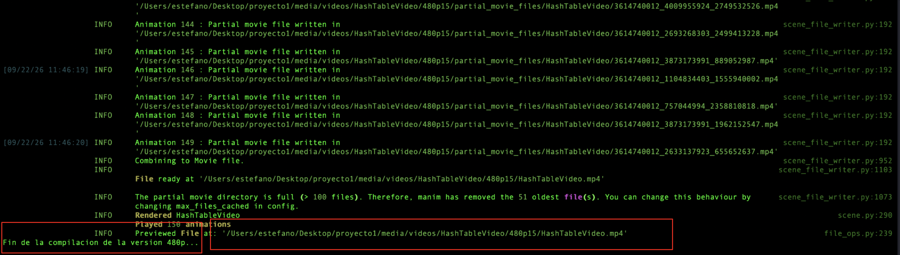
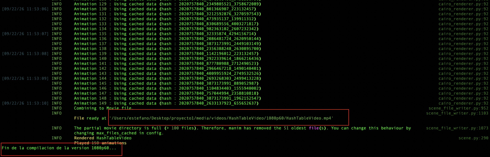
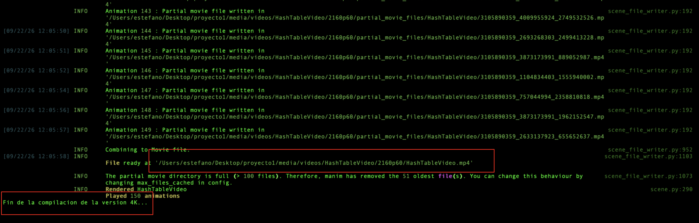
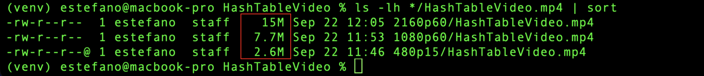

# Tabla Hash y Sus Principales Operaciones

Proyecto 1 · CS2023 Algoritmos y Estructuras de Datos · UTEC


**Profesor:** 
- Luciano A. Romero Calla

**Autores:** 
- Estefano Zárate  100%
- Ignacio Álvarez  100%

Animación hecha con [Manim Community](https://www.manim.community/) que explica paso a paso
cómo funciona una tabla hash: su estructura, las funciones hash más usadas en la industria,
la resolución de colisiones y el costo de cada operación. Duración aproximada: 1 minuto 51 segundos.

## Enlace del video
Acceso al video en su maxima resolucion en *Google Drive*: [HashTable4K](https://drive.google.com/file/d/1kK1xhFyZmYV-s9qsPJRuhoOfJF90c2_z/view?usp=sharing)

## Contenido del video

1. Título y autores.
2. Motivación: búsqueda lineal O(n) frente a calcular la posición con h(k), O(1).
3. Estructura: array de m buckets y factor de carga α = n/m. Todos los ejemplos usan
   códigos de alumno UTEC (formato AÑO-xx-xxx, por ejemplo 202612345) como claves.
4. Funciones hash: método de la división (y el error de usar solo el año del código), [multiplicativo de Knuth](https://stackoverflow.com/questions/11871245/knuths-multiplicative-hash), Fibonacci hashing,
   y las usadas en la industria ([PostgreSQL](https://www.postgresql.org/) `hash_any()`, Java HashMap y C++ `std::unordered_map`).
5. Resolución de colisiones por encadenamiento (listas enlazadas), como en `std::unordered_map`.
6. Direccionamiento abierto: sondeo lineal, cluster primario, sondeo cuadrático,
   doble hashing y eliminación con *tombstones*.
7. Costo de las operaciones (promedio y peor caso).
8. Rehashing con `max_load_factor()` = 1.0 (C++) y costo amortizado.
9. Comparación de sondeos esperados frente a α.
10. Créditos.

## La estructura de datos

Una tabla hash organiza información en pares de clave y valor dentro de un arreglo con $m$ casillas (buckets). Su pieza central es la función hash $h(k)$, que calcula la posición exacta para cada clave, haciendo que insertar, buscar o eliminar datos tome un tiempo promedio prácticamente instantáneo ($O(1)$).

| Operación | Promedio        | Peor caso |
|-----------|-----------------|-----------|
| Insertar  | O(1)            | O(n)      |
| Buscar    | O(1 + α)        | O(n)      |
| Eliminar  | O(1 + α)        | O(n)      |

## Software requerido

- [Python 3.9](https://www.python.org/)
- [Excalidraw](https://excalidraw.com/)
- [Manim Community v0.18 o superior](https://www.manim.community/) (`pip install -r requirements.txt`)

## Cómo compilar y ejecutar

## Instalar los requerimientos de packetes/librerias de Python3
```bash
pip install -r requirements.txt
```
## Compilar el video en la version 480p (se abre al terminar)
```bash
manim -pql HashTableVideo.py HashTableVideo
```

### Output esperado

## Compilar el video en la version 1080p60 (se abre al terminar)
```bash
manim -qh  HashTableVideo.py HashTableVideo
```

### Output esperado

## Este ultimo paso es opcional: Compilar el video en la version 4K
```bash
manim -qk  HashTableVideo.py HashTableVideo
```

### Output esperado


## Los videos compilados quedan almacenados en la siguiente ruta relativa del proyecto
### Video 480p
`/media/videos/HashTableVideo/480p15/HashTableVideo.mp4` (MPEG-4 / H.264).

### Video 1080p60
`/media/videos/HashTableVideo/1080p60/HashTableVideo.mp4` (MPEG-4 / H.264).

### Video 2160p60
`/media/videos/HashTableVideo/2160p60/HashTableVideo.mp4` (MPEG-4 / H.264).

### Pesos de los videos compilados en funcion de sus calidades [480p | 1080p60 | 2160p60]
*En esta captura usando el comando `ls -lh */HashTableVideos.mp4 | sort` se puede apreciar las diferencias en los pesos de los archivos en funcion de su calidad (480p15 | 1080p60 | 2160p60) luego ese output lo ordenamos de mas pesado a menos pesado con `sort`*

## Estructura del código
El script de Python3 `HashTableVideo.py` contiene una sola escena, `HashTableVideo`, dividida en un método por sección
(`intro`, `funciones_hash`, `encadenamiento`, `open_addressing`, etc.). Los valores numéricos
que aparecen en pantalla (división, Knuth, Fibonacci hashing) se calculan en tiempo de ejecución,
así que son exactos.
